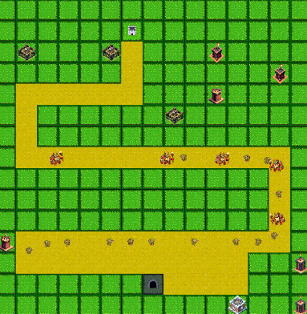
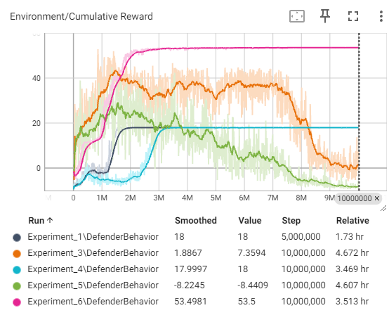
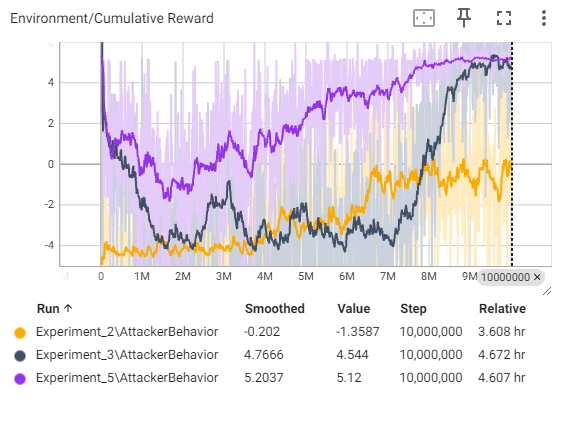

# Reinforcement learning agents duel in an asymetrical tower defense game simulation.
This repository presents a simple tower defense game which can be used as an effective environment for experimentation with reinforcement learning techniques. 

## Environment
The game takes place on a tile based map upon which two players duel. The defender player is in charge of placing defensive towers on the map, whereas the attacker selects type and number of units that will be traversing the path to attack the castle. Once the castle is destroyed attacker wins. Defender wins if attacker fails to destroy the castle before final wave ends.

  
   <i>The example of gameplay taking place on one generated map</i>

There are three types of units:
- Goblins
- Orcs
- Troll

And three types of towers:
- Mages
- Archers
- Cannons

Each unit and tower has its own element, one of three available:
- Fire
- Ice
- Forest

The elements deal additional damage to the element they counter and deal limited damage to the element they're countered by: 
**Fire > Forest > Ice > Fire**

## Experimentation and results
Several experiments had been conducted using included environment and <a href="https://github.com/Unity-Technologies/ml-agents">ML-Agents library from Unity</a>.

The repository contains results of 6 of said experiments, and generally the agents managed to learn properly in each given scenario. 
<table align="center">
<tr>
<td align="center"></td>
<td align="center"></td>
</tr>

<tr><td align="center" colspan=2><i>
A cumulative rewards gathered by the agents as the training progressed up to 10 milion of steps in various experiments 
</i></td></tr>
</table>

The detailed results can be seen by starting Tensoarboard with the command: ``tensorboard --logdir=Experiments/Results``

A short summary of the conducted experiments: 
1. Stable environment (no map randomization, constant enemy waves) - defender training only
2. Stable environment (no map randomization, constant tower placement) - attacker training only
3. Stable environment (no map randomization) - attacker vs defender training
4. Unstable environment (map randomization, constant enemy waves) - defender training only
5. Unstable environment (map randomization) - devender vs attacker tranining
6. Satble environment, inbalanced game state (no map randomization, constant enemy waves, one of towers was made extremely powerful) - defender training

## How can you conduct your own experiments?
- The provided environment is an Unity project (version ``2021.3.33f1``).
- You need to create a python 3.9.13 environment. This can be done either via the provided script ``create_environment.sh``
or manually, by installing the list of ``pip_requirements.txt``.

- Once you have Unity project opened up and running and python environment ready, you can start the training process using ``ml-agents learn --run-id=Experiment_X`` command.
The manual for use and configuration of ML-Agents can be found <a href="https://github.com/Unity-Technologies/ml-agents/blob/develop/docs/Getting-Started.md">here</a>.

- You can adjust the game balance, units and towers parameters and such by editing scriptable objects representing their statistics in ``Assets/Prefabs/[Enemies|Towers]``

- Adjustements to the reward function of agents can be made in classes ``RLAttackerController`` and ``RLDefenderController`` in the `AddRewards()` methods.

- Changes to the environment can be made in its prefab. Most notable things you may want to experiment with is using random or constant seed for the map (random maps add more complexity to the training).

- Results of both the ongoing and finished experiments can be monitored using Tensorboard attached to the results directory `tensorboard --logdir=<your_results_directory>`. By default via your browser at `http://localhost:6006/`.
